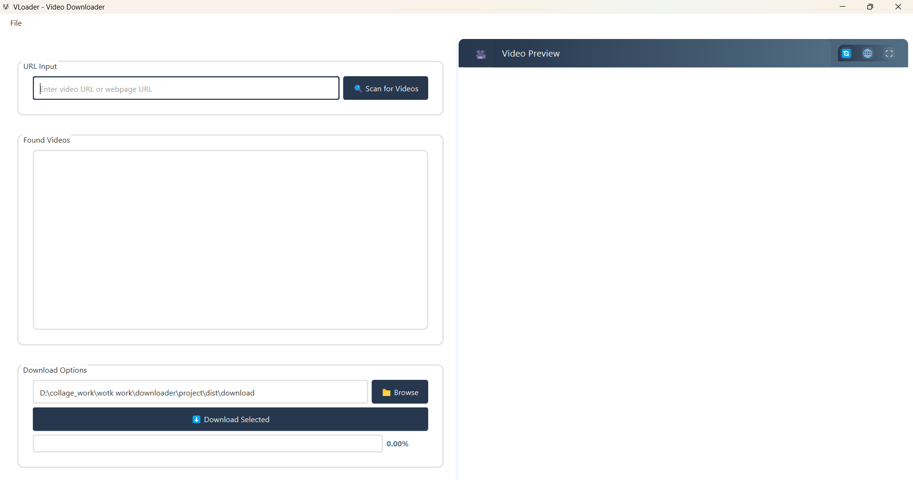
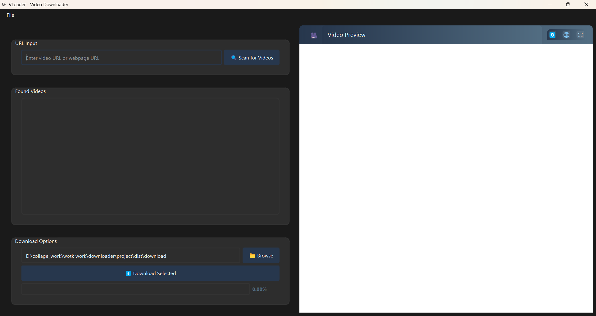

# VLoader - Modern Video Downloader 🎥

<div align="center">


A powerful, user-friendly video downloader with a modern UI built in Python 🚀

[](https://opensource.org/licenses/MIT)
[](https://www.python.org/)
[](https://www.riverbankcomputing.com/software/pyqt/)
[](https://github.com/yourusername/vloader/releases)
[](https://github.com/yourusername/vloader/stargazers)

</div>

## ✨ Features

- 🎯 **Universal Support**: Download videos from YouTube, Instagram, and many other platforms
- 🌐 **Built-in Preview**: Live video preview with dark mode support
- 🎨 **Modern UI**: Clean interface with Light/Dark theme options
- 💾 **Batch Downloads**: Download multiple videos simultaneously
- 📋 **Smart URL Detection**: Drag & drop URL support with automatic video detection
- ⚡ **Fast & Efficient**: Optimized download engine with progress tracking
- 🔒 **Privacy Focused**: Browser cookie integration for protected content
- 🌍 **Multi-platform**: Works on Windows, macOS, and Linux
- 🎮 **User Friendly**: Intuitive controls and keyboard shortcuts

## 🖥️ Screenshots

<div align="center">


</div>

## 🚀 Installation

### Prerequisites
- Python 3.6+
- pip (Python package manager)

### Method 1: Using pip
```bash
pip install vloader
```

### Method 2: From source
```bash
# Clone the repository
git clone https://github.com/yourusername/vloader.git

# Navigate to directory
cd vloader

# Install dependencies
pip install -r requirements.txt

# Run the application
python main.py
```

## 📦 Dependencies

- PyQt6
- yt-dlp
- requests
- beautifulsoup4
- browser-cookie3

## 🎮 Usage

1. Launch VLoader
2. Enter a video URL or webpage URL
3. Click "Scan for Videos" to detect available videos
4. Select your preferred video quality
5. Choose download location
6. Click "Download" to start

### ⌨️ Keyboard Shortcuts

- `Ctrl + V`: Paste URL
- `Ctrl + D`: Download selected video
- `Ctrl + ,`: Open settings
- `Esc`: Exit fullscreen

## 🛠️ Configuration

VLoader can be configured through the Settings dialog (`Ctrl + ,`):

- 🎨 Theme selection (Light/Dark)
- 📂 Default download directory
- 🌐 Browser cookie integration
- 🎥 Video quality preferences

## 🤝 Contributing

Contributions are welcome! Please feel free to submit a Pull Request. For major changes, please open an issue first to discuss what you would like to change.

1. Fork the repository
2. Create your feature branch (`git checkout -b feature/AmazingFeature`)
3. Commit your changes (`git commit -m 'Add some AmazingFeature'`)
4. Push to the branch (`git push origin feature/AmazingFeature`)
5. Open a Pull Request

## 📝 License

This project is licensed under the MIT License - see the [LICENSE](LICENSE) file for details.

## 🙏 Acknowledgments

- [PyQt6](https://www.riverbankcomputing.com/software/pyqt/) for the amazing GUI framework
- [yt-dlp](https://github.com/yt-dlp/yt-dlp) for the powerful download engine
- All our [contributors](https://github.com/yourusername/vloader/contributors)

## 📧 Contact

Your Name - [@yourtwitter](https://twitter.com/yourtwitter) - email@example.com

Project Link: [https://github.com/yourusername/vloader](https://github.com/yourusername/vloader)

---

<div align="center">
Made with ❤️ by [Your Name/Team]
</div>
